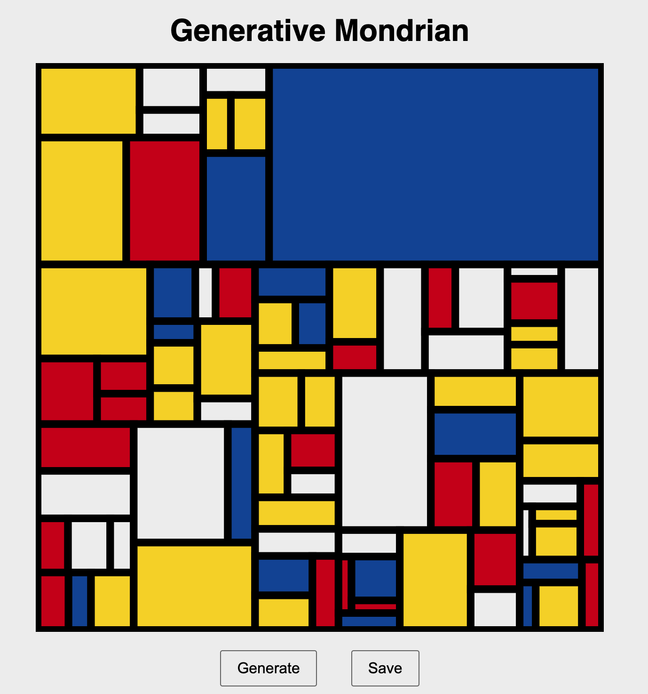

# Generative Mondrian

A simple web app that creates random Mondrian-style art using HTML Canvas. Try it here: https://cute-sunflower-b8d468.netlify.app/

## Features

- Generates abstract art with rectangles and primary colors
- Click "Generate" to create a new design
- Click "Save" to download your artwork as a PNG image

## How to Use

1. Open the `index.html` file in your browser
2. Click **Generate** to make a new design
3. Click **Save** to download it

## Tech Stack

- HTML
- CSS
- JavaScript (Canvas API)

## Inspired By

The art of [Piet Mondrian](https://en.wikipedia.org/wiki/Piet_Mondrian)

## License

MIT
